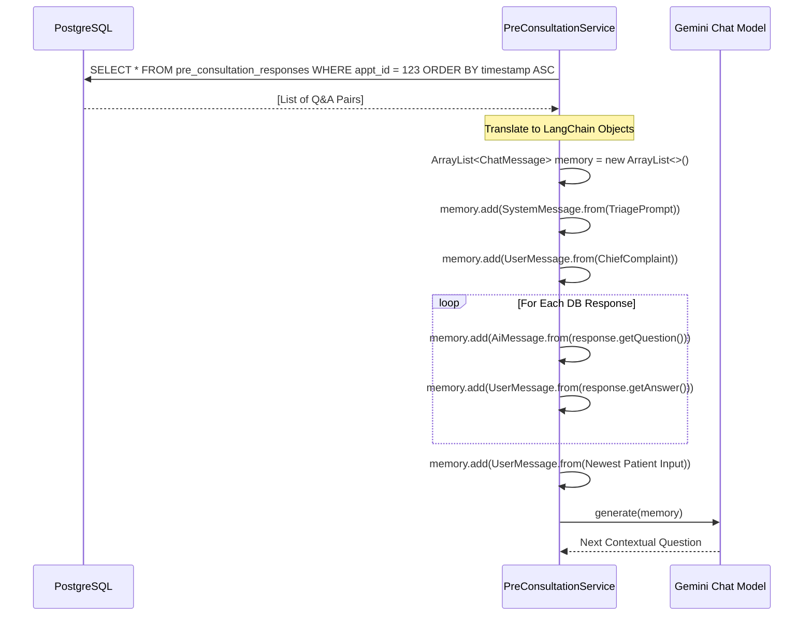

# Part 4: AI Member(2) — AI Pre-Consultation & Documentation

## 1. Deep Dive: LangChain4j Conversational Memory

A standard LLM is stateless. To conduct a medical triage interview, the AI must "remember" the patient's chief complaint and prior answers. Instead of sending raw string transcripts, the backend utilizes LangChain4j's robust object model.

### 1.1 Memory Reconstruction Sequence
When a patient sends the 3rd message in a chat, the `PreConsultationService` does the following:


By mapping the database rows directly to `SystemMessage`, `UserMessage`, and `AiMessage`, Gemini maintains perfect conversational continuity.

## 2. Deep Dive: Strict JSON Extraction from Unstructured PDFs

The hardest problem in medical AI is turning unstructured legacy PDFs (from varying lab vendors) into structured application state. We solve this using a deterministic JSON extraction pipeline.

### 2.1 The Pipeline
1.  **Apache PDFBox:** Extracts raw text (ignoring images/formatting).
2.  **Temperature 0.0:** The Gemini model is initialized with a temperature of `0.0`. This turns off the model's "creativity" engine, making it behave like a strict regex parser.
3.  **The Extraction Prompt:** We inject a strict JSON schema into the system prompt.

### 2.2 The Expected JSON Schema
The backend `MedicalDocumentSummarizationService` expects the LLM to output exactly this schema, which is then parsed by Jackson's `ObjectMapper`.

```json
{
  "patientDetails": { 
      "name": "String", 
      "age": "String", 
      "gender": "String" 
  },
  "documentInfo": { 
      "type": "String", 
      "date": "String" 
  },
  "executiveSummary": "String (1-3 sentences. Strict rule: No filler words)",
  "laboratoryResults": [
      { 
          "testName": "String", 
          "result": "String", 
          "unit": "String", 
          "referenceRange": "String", 
          "interpretation": "String (High/Low/Normal)" 
      }
  ],
  "medications": [
      { 
          "medicineName": "String", 
          "dosage": "String", 
          "frequency": "String", 
          "duration": "String" 
      }
  ]
}
```

### 2.3 Fault Tolerance (JSON Parsing)
Because LLMs sometimes wrap valid JSON inside Markdown code blocks (e.g., ````json { ... } ````), the Java service runs a pre-processing trim method to strip backticks before attempting to cast the string to a `JsonNode`. If the LLM completely hallucinates a non-JSON response, the exception is caught, and the `Document` entity's state is marked as `INVALID_JSON`.

## 3. Natural Language Post-Processing

When summarizing chat transcripts, LLMs naturally adopt a first or second-person perspective based on the dialogue (e.g., "The patient told me you have a fever"). 

To ensure the final output reads like professional clinical notes, the backend runs the raw string through a Java regex replacer before saving:
*   `(?i)\byou have\b` → `the patient has`
*   `(?i)\byour\b` → `the patient's`
*   `(?i)\bI am\b` → `the patient is`
*   `(?i)\bmy\b` → `the patient's`

This guarantees the doctor sees: *"The patient has a fever"*, maintaining a professional clinical distance.
