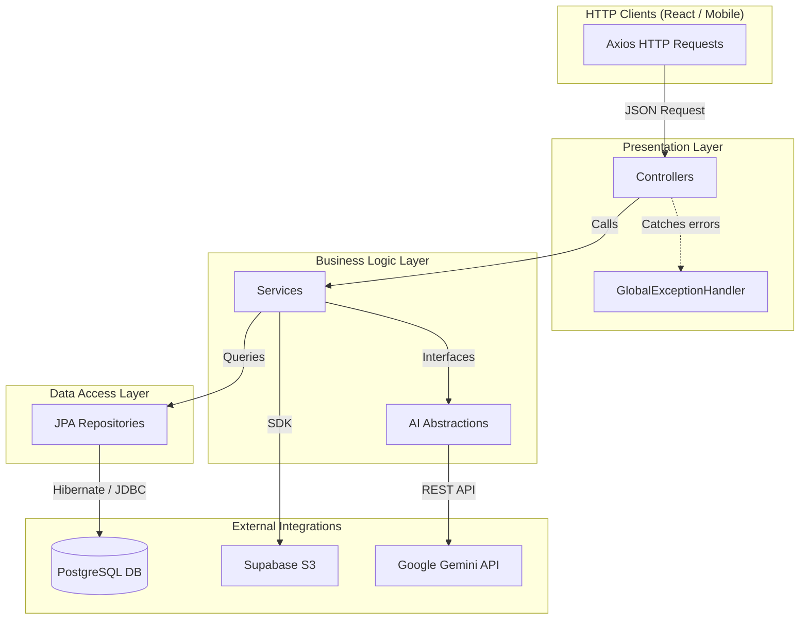

# Part 2: Backend Member 1 — Backend Architecture & APIs

## 1. Monolithic Architecture Overview

The backend is engineered as a robust **Spring Boot 3.3** Monolith running on **Java 21**. It leverages Spring's IoC (Inversion of Control) container for dependency injection, ensuring components are loosely coupled and highly testable.

### 1.1 Layered Application Design



## 2. API Design & Data Transfer Objects (DTOs)

The system never exposes Raw JPA entities to the frontend. This prevents lazy-loading exceptions, accidental over-fetching (exposing password hashes), and mass-assignment vulnerabilities.

Instead, the controllers map requests to strictly typed DTOs.

### 2.1 Pre-Consultation Flow Endpoints

| Method | Endpoint | Description | DTO Contract |
|---|---|---|---|
| `POST` | `/api/pre-consultations` | Starts session | **Req:** `{ appointmentId, chiefComplaint }`<br>**Res:** `{ sessionId, status }` |
| `POST` | `/api/pre-consultations/{id}/chat` | Sends text to AI | **Req:** `{ text }`<br>**Res:** `{ aiResponse, type: "QUESTION" }` |
| `POST` | `/api/pre-consultations/{id}/audio` | Sends voice to AI | **Req:** `multipart/form-data` (file)<br>**Res:** `{ transcribedText }` |
| `POST` | `/api/pre-consultations/{id}/complete` | Generates summary | **Req:** (Empty)<br>**Res:** `{ aiSummaryMarkdown }` |

### 2.2 Medical Document Flow Endpoints

| Method | Endpoint | Description | DTO Contract |
|---|---|---|---|
| `POST` | `/api/documents/upload` | Upload PDF | **Req:** `multipart/form-data`<br>**Res:** `{ documentId, status: "EXTRACTING" }` |
| `GET` | `/api/documents/{id}/status` | Polling endpoint | **Res:** `{ status: "COMPLETED", data: [...] }` |

*Note: The upload endpoint returns immediately after saving the file to Supabase S3. The heavy PDFBox extraction and LangChain4j summarization are handed off to an asynchronous thread pool, preventing HTTP timeouts.*

## 3. Global Exception Handling

Instead of writing `try/catch` blocks in every controller, the application uses a centralized `@ControllerAdvice` class. This ensures the frontend always receives predictable JSON error schemas.

```java
@RestControllerAdvice
public class GlobalExceptionHandler {

    @ExceptionHandler(AiIntegrationException.class)
    public ResponseEntity<ErrorResponse> handleAiError(AiIntegrationException ex) {
        return ResponseEntity
            .status(HttpStatus.SERVICE_UNAVAILABLE)
            .body(new ErrorResponse("AI_SERVICE_DOWN", "The AI is temporarily unavailable."));
    }

    @ExceptionHandler(EntityNotFoundException.class)
    public ResponseEntity<ErrorResponse> handleNotFound(EntityNotFoundException ex) {
        return ResponseEntity
            .status(HttpStatus.NOT_FOUND)
            .body(new ErrorResponse("NOT_FOUND", ex.getMessage()));
    }
}
```

## 4. Caching Architecture

Calling the Gemini LLM for the "Consolidated Patient Summary" takes ~3-5 seconds and costs API credits. To optimize the doctor's experience:
1.  **Cache Hit:** When a doctor requests `/api/doctor/pre-consultation/{id}`, Spring checks the Caffeine in-memory cache using `@Cacheable("patient_summaries", key="#id")`.
2.  **Cache Miss:** If not cached, the `PatientSummaryService` runs the LLM consolidation, returns it to the doctor, and stores it in the cache.
3.  **Cache Eviction:** If the patient uploads a *new* document while waiting, a `@CacheEvict` annotation drops the old summary, forcing the system to regenerate it with the new data the next time the doctor requests it.
