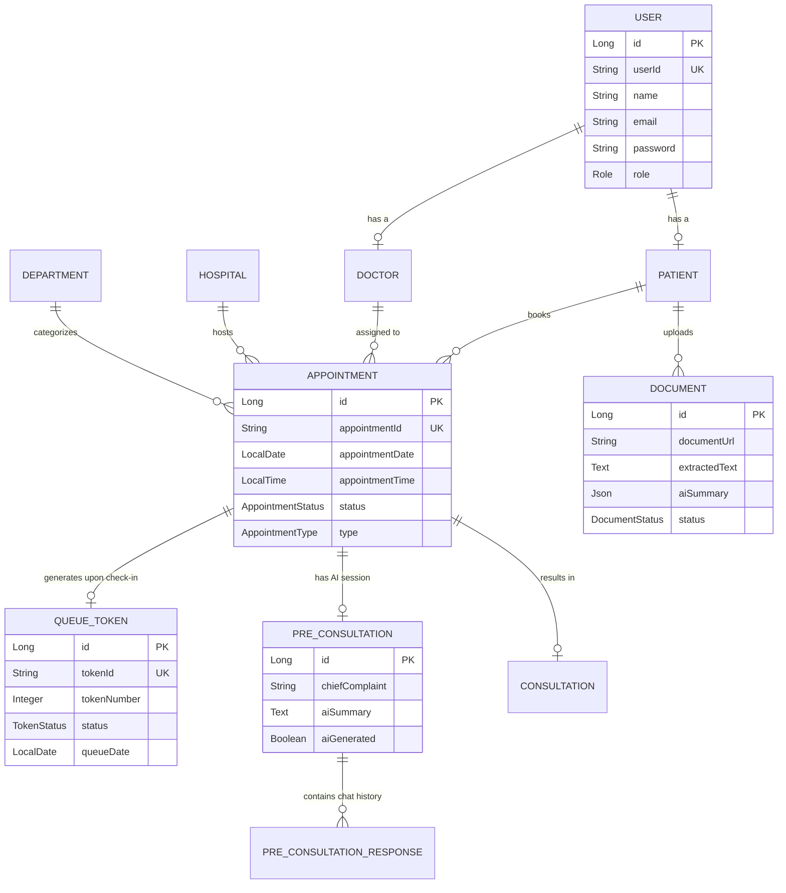
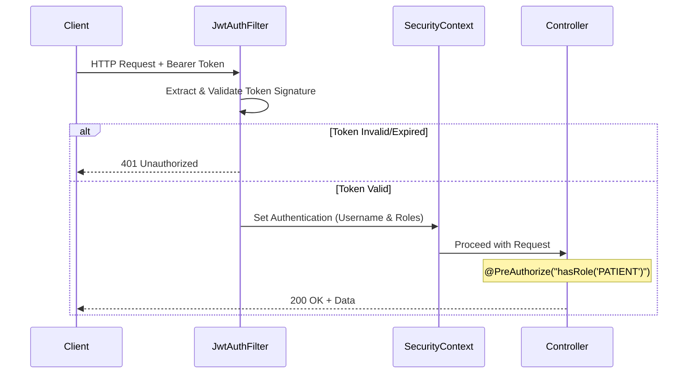
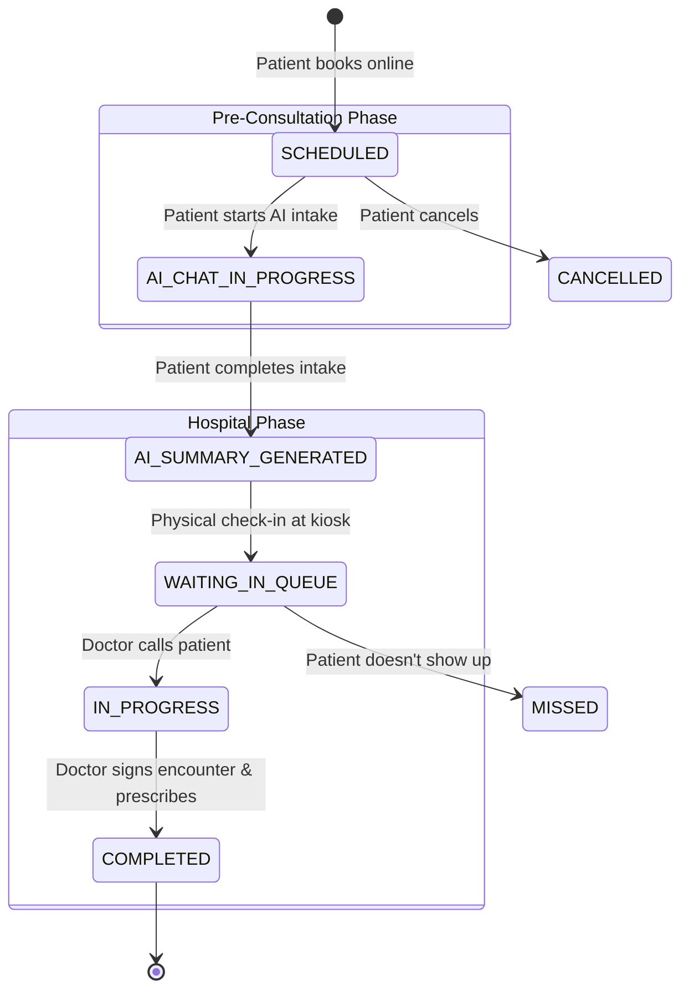

# Part 3: Backend Member 2 — Database, Security & Hospital Workflow

## 1. Database Architecture & ER Diagram

The database is built on PostgreSQL (hosted serverlessly on Neon). It uses a highly normalized schema optimized for heavy read/write operations typical in a hospital setting (e.g., querying real-time queues, saving document summaries).

### 1.1 Entity-Relationship (ER) Diagram



### 1.2 JPA Optimization Strategies
*   **Lazy Loading:** All `@ManyToOne` and `@OneToOne` relationships use `FetchType.LAZY` to prevent N+1 select query issues.
*   **Auditing:** `@EntityListeners(AuditingEntityListener.class)` is attached to entities to automatically populate `@CreatedDate` and `@LastModifiedDate`, providing an irrefutable audit trail for medical records.
*   **Unique Constraints:** Prevent double-booking tokens. For example, `QueueToken` enforces `@UniqueConstraint(columnNames = {"doctor_id", "queue_date", "token_number"})`.

---

## 2. Security Architecture (Protecting PHI)

Given that this application processes Protected Health Information (PHI), security is deeply embedded at the HTTP layer.

### 2.1 Authentication Flow (Stateless JWT)
1.  **Login Request:** User submits credentials to `POST /api/auth/login`.
2.  **Validation:** `AuthenticationManager` hashes the password using `BCrypt` and matches it against the DB.
3.  **Token Generation:** A JWT is generated using `HMAC-SHA256` signing (using `JWT_SECRET`). The payload contains the unique `userId` and the user's `Role`.
4.  **Subsequent Requests:** The client attaches `Authorization: Bearer <token>`.

### 2.2 Security Filter Chain


### 2.3 Object-Level Authorization
Role-based access control (RBAC) isn't enough. We enforce **Data Ownership**.
If Patient A hits `GET /api/documents/123`, the controller ensures Document 123 actually belongs to Patient A.
```java
// Example implementation in controllers
public void verifyOwnership(String appointmentId) {
    String currentUserId = SecurityContextHolder.getContext().getAuthentication().getName();
    Appointment appt = repository.findByAppointmentId(appointmentId);
    if (!appt.getPatient().getUser().getUserId().equals(currentUserId)) {
        throw new AccessDeniedException("You do not have permission to view this record.");
    }
}
```

---

## 3. Hospital Workflow State Machine

The backend acts as a digital twin for the physical hospital, enforcing strict state transitions.

### 3.1 Patient Journey State Machine



### 3.2 Dynamic Queueing Engine
When a patient physically arrives and clicks "Check In", the backend:
1. Validates the appointment is today.
2. Checks the `QueueToken` table for the specific doctor & date.
3. Finds the `MAX(token_number)` and assigns `token_number + 1`.
4. Generates an estimated wait time based on historic consultation averages.
