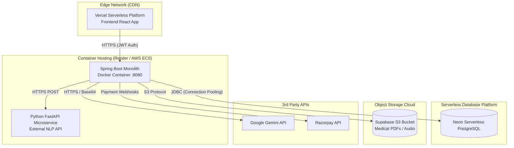

# Part 5: Deployment Member — Deployment & Scalability

## 1. Cloud-Native Deployment Architecture

ArogyaMitra uses a modern, containerized, serverless-hybrid architecture. This ensures the hospital system can scale infinitely during peak traffic without incurring heavy idle costs during night shifts.

### 1.1 Infrastructure Map

## 2. Docker & Containerization

The project uses `docker-compose.yml` for unified deployment. 
By defining the `backend` and `frontend` as distinct services, the infrastructure can be managed as code. Environment variables (like `DB_URL` and `JWT_SECRET`) are injected dynamically at runtime, ensuring no hardcoded credentials exist in the Docker images.

## 3. High Availability & Scalability Strategies

### 3.1 Database: Neon Serverless Postgres
Traditional RDS databases require provisioning for peak capacity, wasting money. 
*   **Autoscaling Compute:** Neon automatically scales compute (CPU/RAM) up during morning OPD rushes.
*   **Scale-to-Zero:** During inactive hours, the DB scales down to zero, saving costs. 
*   **Connection Pooling:** Because the Spring Boot container scales horizontally, we use HikariCP (configured in `application.properties`) to limit connections and prevent overwhelming the Neon DB.

### 3.2 AI Throttling: Round-Robin Keys
LLM APIs strictly rate-limit tokens per minute (TPM). In a hospital, 50 patients checking in simultaneously would crash the system with `429 Too Many Requests`.
*   **Solution:** The backend accepts an array of API keys: `GEMINI_API_KEY=key1,key2,key3`.
*   **Implementation:** An `AtomicInteger` acts as a thread-safe counter. Request 1 uses Key 1, Request 2 uses Key 2, multiplying the effective TPM limit by the number of configured keys.

### 3.3 Thread Exhaustion Prevention (Async Pipeline)
Extracting text from a 20-page medical PDF via Apache PDFBox, then sending it to Gemini, can take 5-10 seconds.
If 100 users upload PDFs, 100 Tomcat HTTP worker threads would block, bringing down the entire API (including simple requests like fetching a doctor's schedule).
*   **Solution:** The backend uses `CompletableFuture.runAsync()`. The HTTP request saves the file to Supabase S3 and immediately returns `200 OK (Status: EXTRACTING)`. The heavy PDFBox extraction is offloaded to a background ForkJoinPool thread.

### 3.4 Stateless Horizontal Scaling
Because the backend uses **JWT (JSON Web Tokens)** instead of JSESSIONID cookies, there is no server-side session memory.
Furthermore, because files are uploaded directly to **Supabase S3** instead of local disk, the backend has no local state.
This means we can run 5 identical Spring Boot containers behind a Load Balancer, and any container can serve any request without needing "Sticky Sessions".
